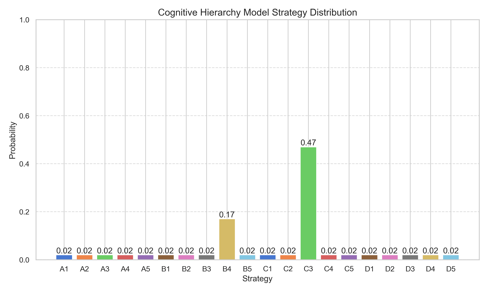

# 宝箱选择高级策略分析系统：综合项目总结

## 一、项目背景与挑战

### 问题背景

在IMC Prosperity竞赛中，参与者面临一个独特的策略决策问题：从多个具有不同特性的宝箱中选择一个、两个或三个，以最大化收益。每个宝箱具有两个关键属性：
- **乘数(Multiplier)**: 决定宝箱基础价值的倍数
- **居民数(Inhabitants)**: 选择该宝箱前已经存在的居民数量

宝箱的最终收益由以下公式决定：
```
收益 = 基础宝藏值(10,000) × 乘数 ÷ (居民数 + 选择该宝箱的玩家百分比)
```

这个看似简单的问题实际上蕴含着丰富的博弈论和决策理论挑战：
1. **策略互动**: 其他玩家的选择直接影响你的收益
2. **不完全信息**: 无法精确预知其他玩家的选择
3. **多层次思考**: 需要考虑"他人如何思考我的思考"的递归推理
4. **行为因素**: 人类决策者受认知偏见和情绪影响
5. **社会影响**: 策略选择可能受社会网络和从众心理影响

### 传统方法的局限

传统的解决方案通常依赖于简单的期望效用计算或基础博弈论分析，存在明显局限性：
- 假设所有玩家都是完全理性的
- 忽略心理和社会因素对决策的影响
- 缺乏对策略如何在群体中演化的考量
- 没有考虑不同思维深度的玩家之间的互动

### 项目目标

本项目旨在开发一个综合性的高级策略分析系统，通过整合多学科理论和方法，为宝箱选择问题提供全面而深入的决策支持。具体目标包括：

1. 构建一个多维度分析框架，从认知、行为、社会和策略四个角度分析问题
2. 模拟真实世界中人类决策的复杂性，包括认知偏见、情绪影响和社会互动
3. 提供直观的可视化结果，帮助理解复杂的策略互动
4. 生成经过多模型交叉验证的稳健策略建议

## 二、系统架构与设计

### 整体架构

宝箱选择高级策略分析系统采用模块化设计，由四个核心分析模块和一个可视化模块组成：

```
advanced_strategy/
├── cognitive_hierarchy/   # 认知层次分析
├── behavioral_economics/  # 行为经济学分析
├── social_dynamics/       # 社会动态分析
├── meta_strategy/         # 元策略分析
└── visualization/         # 可视化工具
```

系统的数据流如下：
1. 初始化宝箱数据和玩家分布参数
2. 各分析模块独立执行其特定方法
3. 元策略分析整合各模块结果
4. 可视化模块将结果转化为直观图表
5. 生成综合分析报告和策略建议

### 核心组件详解

#### 1. TreasureStrategyAnalyzer

`TreasureStrategyAnalyzer`是系统的中枢，负责初始化、协调各模块和整合结果：

```python
class TreasureStrategyAnalyzer:
    def __init__(self, treasures: List, 
                num_players: int = 10000,
                rational_pct: float = 0.35,
                heuristic_pct: float = 0.45,
                random_pct: float = 0.2,
                second_box_pct: float = 0.05,
                second_box_cost: int = 50000):
        # 初始化基本参数
        self.treasures = treasures
        self.num_treasures = len(treasures)
        self.num_players = num_players
        self.rational_pct = rational_pct
        self.heuristic_pct = heuristic_pct
        self.random_pct = random_pct
        self.second_box_pct = second_box_pct
        self.second_box_cost = second_box_cost
        
        # 初始化收益矩阵
        self.payoff_matrix = self._create_payoff_matrix()
        
        # 初始化各种模型
        self._init_models()
        
        # 分析结果
        self.results = {}
```

这个类实现了以下关键方法：
- `_create_payoff_matrix()`: 构建宝箱选择的收益矩阵
- `analyze_with_cognitive_hierarchy()`: 执行认知层次分析
- `analyze_with_behavioral_economics()`: 执行行为经济学分析
- `analyze_with_social_dynamics()`: 执行社会动态分析
- `analyze_with_meta_strategy()`: 执行元策略分析
- `integrate_results()`: 整合各模型结果
- `generate_report()`: 生成分析报告

#### 2. 收益矩阵构建

收益矩阵是分析的基础，它计算在不同对手策略分布下选择每个宝箱的预期收益：

```python
def _create_payoff_matrix(self) -> np.ndarray:
    """
    创建收益矩阵
    
    矩阵中的entry (i,j)表示当玩家选择宝箱i而其他人选择分布j时的收益
    """
    # 创建空的收益矩阵
    payoff_matrix = np.zeros((self.num_treasures, self.num_treasures))
    
    # 对于每种可能的策略分布计算收益
    for i in range(self.num_treasures):
        for j in range(self.num_treasures):
            # i是自己选的宝箱，j是大多数其他玩家选的宝箱
            
            # 创建玩家分布：大部分人选j，少数选其他
            distribution = np.ones(self.num_treasures) * 0.01  # 基础分布
            distribution[j] = 0.9  # 大部分人选j
            distribution = distribution / distribution.sum()  # 归一化
            
            # 计算在这种分布下选i的收益
            treasure_i = self.treasures[i]
            selection_pct = distribution[i] * 100  # 转换为百分比
            payoff = treasure_i.calculate_profit(selection_pct)
            
            payoff_matrix[i, j] = payoff
    
    return payoff_matrix
```

收益矩阵的热图可视化如下所示（横轴为对手策略，纵轴为自己策略）：


这个热图直观地展示了不同策略组合的收益结构，对角线上的元素（相同选择）收益通常较低，表明当多玩家选择相同宝箱时会分散收益。

## 三、多维度分析方法

### 1. 认知层次分析

认知层次分析基于博弈论中的层次思考模型(Level-k Model)，模拟不同思考深度的玩家行为：

```python
def analyze_with_cognitive_hierarchy(self) -> Dict[str, Any]:
    """使用认知层次模型分析宝箱选择"""
    # 设置合理的层次分布：多数玩家是0级和1级，少数是高级
    level_distribution = np.array([0.4, 0.4, 0.15, 0.05])
    self.cognitive_model.set_level_distribution(level_distribution)
    
    # 计算每个层次的最优策略
    level_strategies = {}
    for level in range(4):
        level_strategies[f"Level-{level}"] = self.cognitive_model.get_best_strategy_for_level(level)
    
    # 计算整体策略分布
    overall_distribution = self.cognitive_model.calculate_strategy_distribution()
    
    # 找出最优策略
    best_strategy = np.argmax(overall_distribution)
```

这种分析方法将玩家分为不同的思考层次：
- **Level-0**: 随机选择或使用简单启发式规则
- **Level-1**: 假设其他人是Level-0，选择对应的最佳反应
- **Level-2**: 假设其他人是Level-1，选择对应的最佳反应
- 以此类推...

通过认知层次分析生成的策略分布如下：



### 2. 行为经济学分析

行为经济学分析整合了前景理论、认知偏见和情绪因素，模拟实际人类决策中的非理性因素：

```python
def analyze_with_behavioral_economics(self) -> Dict[str, Any]:
    """使用行为经济学模型分析宝箱选择"""
    # 计算基础收益期望
    base_payoffs = np.mean(self.payoff_matrix, axis=1)
    
    # 应用前景理论
    # 设置参数：损失厌恶系数=2.25，价值函数曲率=0.88
    prospect_weights = self.prospect_model.calculate_prospect_weights(
        base_payoffs, 
        reference_point=np.mean(base_payoffs),
        loss_aversion=2.25,
        value_curve=0.88
    )
```

行为经济学分析产生的权重分布如下：


### 3. 社会动态分析

社会动态分析模拟了策略选择如何在群体中演化和传播，考虑社会网络和模仿行为的影响：

```python
def analyze_with_social_dynamics(self, num_iterations=30) -> Dict[str, Any]:
    """使用社会动态模型分析宝箱选择"""
    # 初始化策略分布
    initial_distribution = np.ones(self.num_treasures) / self.num_treasures
    
    # 参数设置：学习率、噪声水平和社会影响强度
    learning_rate = 0.2
    noise_level = 0.05
    social_influence = 0.3
    
    # 执行策略演化
    evolution_data, final_distribution = self.social_model.simulate_evolution(
        initial_distribution,
        self.payoff_matrix,
        num_iterations,
        learning_rate,
        noise_level,
        social_influence
    )
```

社会动态模型的策略分布演化如下：


最终的社会动态策略分布：


### 4. 元策略分析

元策略分析整合了前三个模型的结果，寻找在各种可能的对手策略分布下稳健的最优回应：

```python
def analyze_with_meta_strategy(self) -> Dict[str, Any]:
    """使用元策略分析整合多种模型结果"""
    # 收集各模型预测的对手策略分布
    cognitive_dist = self.results["cognitive_hierarchy"]["overall_distribution"]
    behavioral_dist = self.results["behavioral_economics"]["final_weights"]
    social_dist = self.results["social_dynamics"]["final_distribution"]
    
    # 对各分布计算最优回应
    cognitive_br = self.meta_model.calculate_best_response(cognitive_dist)
    behavioral_br = self.meta_model.calculate_best_response(behavioral_dist)
    social_br = self.meta_model.calculate_best_response(social_dist)
    
    # 综合所有预测，计算一致性最高的策略
    strategy_votes = [cognitive_br, behavioral_br, social_br]
    most_consistent = max(set(strategy_votes), key=strategy_votes.count)
```

各模型的最佳策略比较：


## 四、结果与建议

### 策略比较与评估

系统从三个层次评估宝箱选择策略：

1. **单选策略**：选择单一宝箱的最优选择
2. **双选策略**：考虑第二宝箱成本后的最优两宝箱组合
3. **三选策略**：考虑第三宝箱成本后的最优三宝箱组合

不同策略类型的预期收益比较：


## 五、应用与实际价值

本项目开发的高级策略分析系统具有广泛的应用价值：

1. **竞赛决策支持**：为IMC Prosperity参赛者提供科学的决策依据
2. **策略博弈教学**：可作为策略博弈理论的实践教学工具
3. **人类决策研究**：可用于研究不同理论框架下的人类决策行为
4. **金融市场建模**：类似方法可应用于金融市场的策略互动建模

## 六、总结与展望

高级策略分析系统通过整合认知层次理论、行为经济学、社会动态分析和元策略分析，为宝箱选择问题提供了全面而深入的决策支持。系统的创新之处在于：

1. **多维度整合**：跨学科整合多种决策理论
2. **人类行为建模**：考虑认知偏见和社会互动
3. **鲁棒性分析**：通过多模型交叉验证提高建议可靠性
4. **可视化决策支持**：直观展示复杂的策略互动

未来工作方向包括：

1. 扩展系统以处理更复杂的多轮互动博弈
2. 加入机器学习模型预测对手行为
3. 开发交互式界面，便于用户探索不同参数组合
4. 整合实际玩家行为数据，进一步优化模型参数

通过这些创新，高级策略分析系统不仅为宝箱选择问题提供了有力的解决方案，也为复杂博弈环境中的策略决策提供了一个通用框架。 