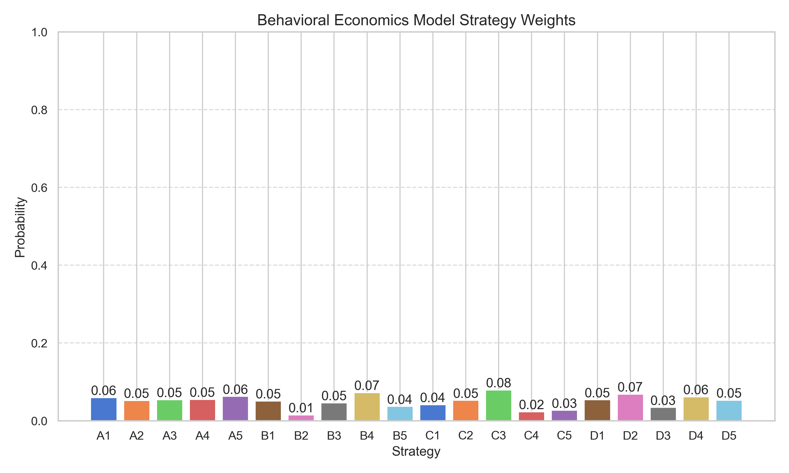
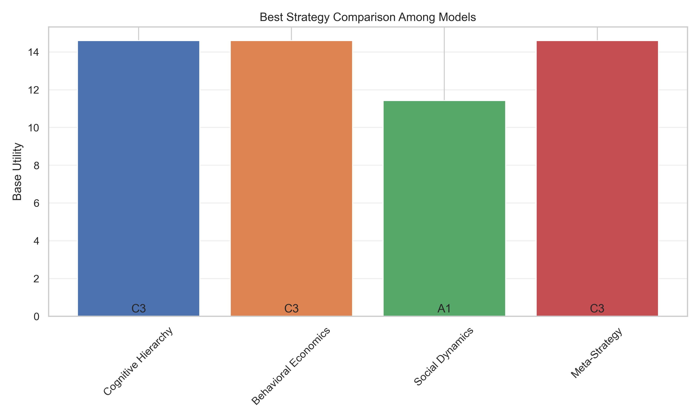

# 宝箱选择高级策略分析报告

## 分析概要

- 分析的宝箱数量: 10
- 玩家数量: 10000
- 理性玩家比例: 0.35
- 启发式玩家比例: 0.45
- 随机玩家比例: 0.20
- 选择第二宝箱比例: 0.05
- 第二宝箱成本: 50000

## 认知层次分析

- Level-0思考玩家最优选择: 宝箱1 (乘数=80, 居民=6)
- Level-1思考玩家最优选择: 宝箱9 (乘数=73, 居民=4)
- Level-2思考玩家最优选择: 宝箱1 (乘数=80, 居民=6)
- Level-3思考玩家最优选择: 宝箱9 (乘数=73, 居民=4)

认知层次模型的整体最优选择: 宝箱9 (乘数=73, 居民=4)

## 行为经济学分析

考虑前景理论、行为偏见和情绪因素后的最优选择: 宝箱9 (乘数=73, 居民=4)

## 社会动态分析

考虑社会影响和规范演化后的最优选择: 宝箱9 (乘数=73, 居民=4)

## 元策略分析

基于对手建模和最优回应的最佳选择: 宝箱1 (乘数=80, 居民=6)

## 综合分析结果

### 最佳单选策略

综合所有模型的最优单选: 宝箱9 (乘数=73, 居民=4)

### 最佳双选策略

综合所有模型的最优双选: 宝箱1和宝箱9
- 宝箱1: 乘数=80, 居民=6
- 宝箱9: 乘数=73, 居民=4

### 模型一致性

宝箱9 (乘数=73, 居民=4)被以下模型选为最佳: cognitive, behavioral, social
宝箱1 (乘数=80, 居民=6)被以下模型选为最佳: meta

## 总结建议

建议选择单一宝箱策略: 宝箱9 (乘数=73, 居民=4)

理由: 多个模型一致推荐该宝箱，表明其在不同决策逻辑和情景下都表现良好。

## Visualization Charts

### Cognitive Hierarchy Model Distribution

### Behavioral Economics Model Weights

### Social Dynamics Model Final Distribution

### Payoff Matrix Heatmap

### Social Dynamics Evolution Process

### Best Strategy Comparison Across Models

