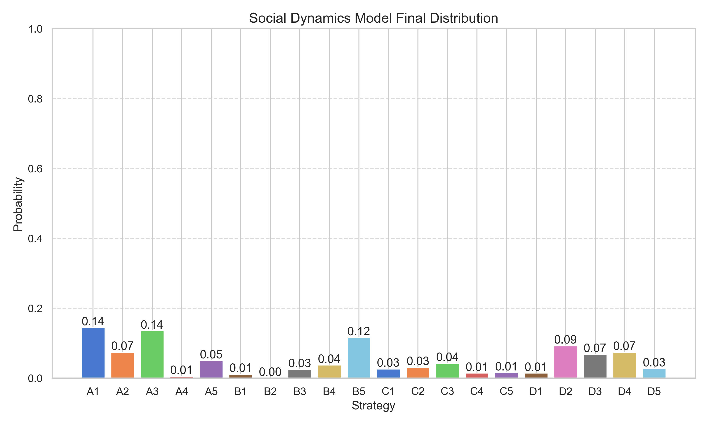
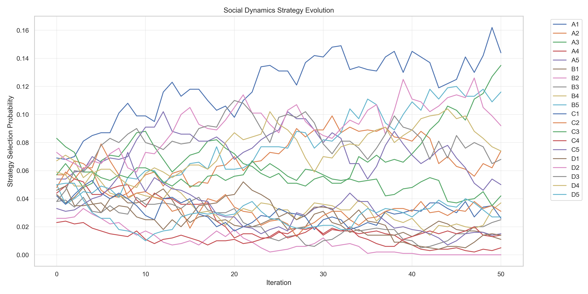
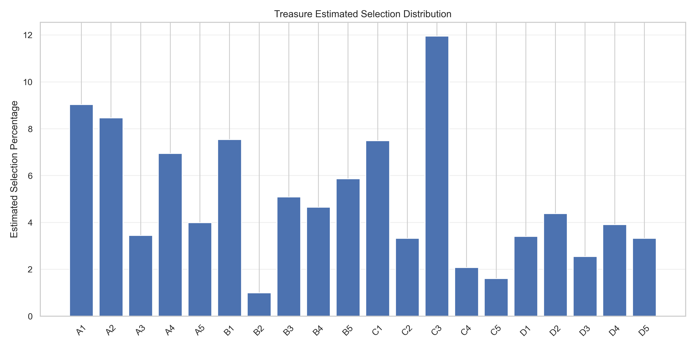

# 宝箱选择高级策略分析报告
## 分析概要
- 分析的宝箱数量: 20
- 玩家数量: 4130
- 理性玩家比例: 0.50
- 启发式玩家比例: 0.30
- 随机玩家比例: 0.20
- 选择第二宝箱比例: 0.15
- 第二宝箱成本: 50000
- 选择第三宝箱比例: 0.05
- 第三宝箱成本: 100000

## 综合分析结果

### 最佳单选策略
无法确定最优单选策略。所有模型的分析结果不一致或无法产生有效的单选策略推荐。

### 最佳双选策略
综合所有模型的最优双选: 宝箱B4和宝箱D2
- 宝箱B4: 乘数=70, 居民=4
- 宝箱D2: 乘数=79, 居民=5
预期净收益: 115170.01

### 最佳三选策略
综合所有模型的最优三选: 宝箱A3、宝箱B4和宝箱D2
- 宝箱A3: 乘数=83, 居民=7
- 宝箱B4: 乘数=70, 居民=4
- 宝箱D2: 乘数=79, 居民=5
预期净收益: 94614.51

### 模型一致性
- 认知层次模型: 宝箱C3
- 行为经济学模型: 宝箱C3
- 社会动态模型: 宝箱B1
- 元策略模型: 宝箱C3

模型一致性评估: 部分一致 (75%)

## 总结建议
建议选择双宝箱策略: 宝箱B4和宝箱D2

预期净收益: 115170.01

理由: 综合考虑了各宝箱的基础属性、玩家行为模式和预期收益后，上述策略在当前条件下提供最高的预期收益。

## 可视化图表

### 认知层次模型分布

### 行为经济学模型权重

### 社会动态模型最终分布

### 收益矩阵热图

### 社会动态演化过程

### 各模型最佳策略比较

### 不同策略预期收益比较

### 宝箱预估选择分布

